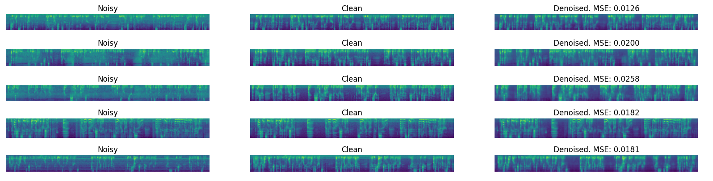
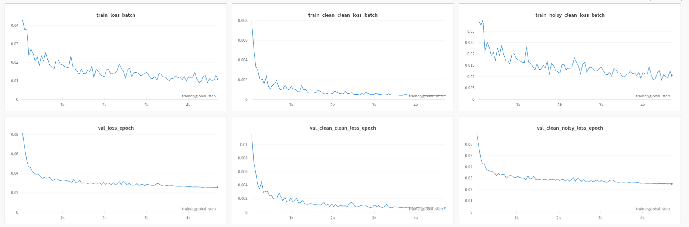

### **Описание решения**

В основе решения лежит модель архитектуры UNet -- автоэнкодер, который учится восттанавливать чистый звук из зашумленного по его мел-спектограмме (1) или предсказывать шум (2).

### **Создать и активировать виртуальное окружение**

```
make install
```


### **Запустить обучение**

- Настроить гиперпараметры можно в файле `config.py`.
- Метрики и конфигурация эксперимента логируются в [W&B](https://wandb.ai/), поэтому при запуске обучения необходимо предварительно туда залогиниться.

1. Модель, которая восстанавливает чистый звук из зашумленного:

```commandline
make train_recover
```

2. Модель, которая предсказывает шум по мел-спектограмме (мел-спектограмма чистого звука = мел-спектограмма звука - мел-спектограмма предсказанного шума)

```commandline
make train_predict_noise
```


В ходе экспериментов лучшее качество показала модель (1), поэтому на инференсе будет использована эта модель.

### **Инференс**


Для инференса написан класс `Denoiser` (`src/predict.py`). Веса предварительно должны быть сконвертированы в формат ONNX:

```
python src/torch2onnx.py <args>
```


### **Тестирование**

Запустить тестирование качества модели:

```
make test DATA_DIR=/path/to/data/ CKPT_PATH=/path/to/model.onnx
```
- `DATA_DIR`: путь до корневой папки с двумя подпапками `clean` и `noisy` (должна повторять структуру папок для обучения и валидации);
- `CKPT_PATH`: путь до весов модели в формате ONNX.


#### **Визуализация на валидационной выборке:**





#### **Графики обучения:**



Веса итоговой модели опубликованы в релизе.